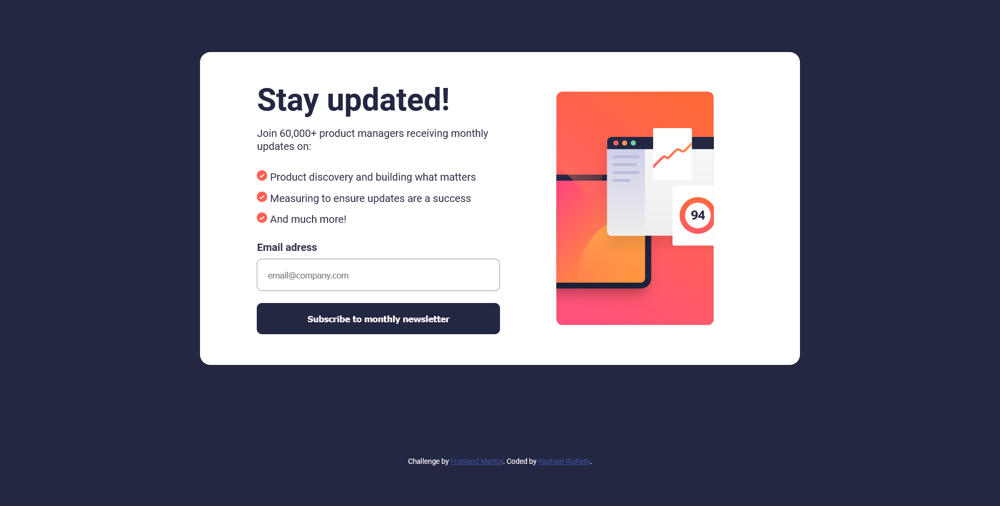

# Frontend Mentor - Newsletter sign-up form with success message solution

This is a solution to the [Newsletter sign-up form with success message challenge on Frontend Mentor](https://www.frontendmentor.io/challenges/newsletter-signup-form-with-success-message-3FC1AZbNrv). Frontend Mentor challenges help you improve your coding skills by building realistic projects. 

## Table of contents

- [Overview](#overview)
  - [The challenge](#the-challenge)
  - [Screenshot](#screenshot)
  - [Links](#links)
- [My process](#my-process)
  - [Built with](#built-with)
  - [What I learned](#what-i-learned)
  - [Continued development](#continued-development)
  - [Useful resources](#useful-resources)
- [Author](#author)

## Overview

### The challenge

Users should be able to:

- Add their email and submit the form
- See a success message with their email after successfully submitting the form
- See form validation messages if:
  - The field is left empty
  - The email address is not formatted correctly
- View the optimal layout for the interface depending on their device's screen size
- See hover and focus states for all interactive elements on the page

### Screenshot

### Links

- Solution URL: [https://www.frontendmentor.io/solutions/newsletter-signup-form-with-success-message-raphael-righetti-okOzDxyCep](https://www.frontendmentor.io/solutions/newsletter-signup-form-with-success-message-raphael-righetti-okOzDxyCep)
- Live Site URL: [https://raphaelrighetti.com/newsletter-signup/](https://raphaelrighetti.com/newsletter-signup/)

## My process

### Built with

- [React](https://reactjs.org/) - JS library
- Flexbox
- CSS Grid

### What I learned

Building this project, I was able to practice my CSS skills using the React library, as well as my React skills.

### Continued development

Embarking on the journey of learning the React library has been an enjoyable and gratifying experience. I am eager to dive into more complex and ambitious projects as my proficiency in React continues to evolve.

### Useful resources

- I utilized the guidance provided in [Deploying a Static Site | Vite](https://vitejs.dev/guide/static-deploy) to successfully deploy my project to GitHub Pages.

## Author

- Website - [raphaelrighetti.com](https://raphaelrighetti.com/)
- LinkedIn - [Raphael Righetti Ramos](https://www.linkedin.com/in/raphael-righetti-ramos/)
- GitHub - [raphaelrighetti](https://github.com/raphaelrighetti)
- Frontend Mentor - [@raphaelrighetti](https://www.frontendmentor.io/profile/raphaelrighetti/)
